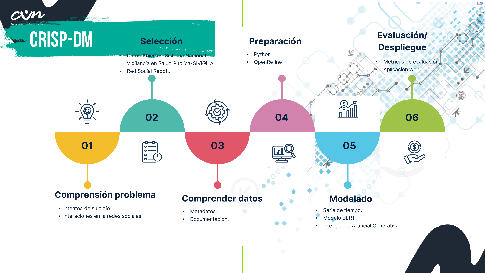

# Análisis Estadístico Descriptivo y Predictivo de los Intentos de Suicidio en Colombia (2016-2023) e Identificación de Ideas Suicidas en Redes Sociales mediante Modelos de Aprendizaje Profundo-

## Descripción del Proyecto
Este proyecto tiene como objetivo realizar un análisis estadístico descriptivo y predictivo sobre los datos de intentos de suicidio en Colombia en el periodo de 2016 a 2023. Además, busca identificar ideas suicidas en redes sociales mediante el uso de modelos de aprendizaje profundo. Este análisis proporciona una visión integral sobre el comportamiento de los intentos de suicidio y utiliza datos no estructurados de redes sociales para identificar patrones de riesgo.

## Objetivos
1. **Análisis descriptivo**: Explorar y describir los datos de intentos de suicidio en Colombia entre 2016 y 2023.
2. **Predicción**: Desarrollar modelos predictivos de series temporales para proyectar tendencias para los años 2024 y 2025.
3. **Identificación de ideas suicidas en redes sociales**: Analizar datos no estructurados provenientes de una red social utilizando un modelo de aprendizaje profundo, con el fin de identificar mensajes que podrían indicar ideación suicida.
4. **Asistente virtual de primeros auxilios psicológicos**: Proveer un asistente que responda preguntas sobre los datos y brinde apoyo en primeros auxilios psicológicos.

## Metodología para la Analítica de Datos: CRISP-DM
En este proyecto, se ha empleado la metodología CRISP-DM (Cross-Industry Standard Process for Data Mining), un estándar ampliamente utilizado en el análisis de datos. CRISP-DM proporciona un marco estructurado que ayuda a guiar el proceso de análisis y minería de datos, asegurando una aproximación sistemática desde la comprensión de los datos hasta la obtención de resultados prácticos. Esta metodología consta de seis fases principales:

## Estructura del Proyecto
El proyecto cuenta con una interfaz interactiva desarrollada con Python y Streamlit, compuesta por varias secciones:

1. **Página de Inicio**: Una bienvenida a los usuarios, con una breve introducción al proyecto.
2. **Situación Problema**: Descripción detallada del contexto y la problemática abordada en el proyecto.
3. **Panel de Control Interactivo**: Visualización de gráficos y estadísticas descriptivas sobre los intentos de suicidio en Colombia, junto con un análisis predictivo de series temporales para los años 2024 y 2025.
4. **Asistente Virtual**: Un asistente virtual que proporciona análisis de datos, responde preguntas sobre los datos y actúa como un asistente de primeros auxilios psicológicos.
5. **Información de los Desarrolladores y Contacto**: Información sobre los autores del proyecto y un formulario de contacto para recibir retroalimentación.

## Tecnologías Utilizadas
- **Lenguaje de Programación**: Python
- **Herramientas de Desarrollo**: Visual Studio Code, Google Colab, GitHub
- **Herramientas de Visualización**: Streamlit, Excel
- **Fuentes de Datos**: Datos abiertos de Colombia, SIVIGILA

## Requisitos del Sistema
Para ejecutar este proyecto, asegúrate de tener instaladas las siguientes bibliotecas en tu entorno de Python:

- `streamlit`
- `pandas`
- `numpy`
- `matplotlib`
- `scikit-learn`
- `transformers` (para modelos de aprendizaje profundo)
- `requests` (para interacción con redes sociales y otros datos externos)

## Fuentes de Datos
Los datos utilizados en este proyecto fueron obtenidos de Datos Abiertos de Colombia y el Sistema de Vigilancia en Salud Pública (SIVIGILA).

## Créditos
Proyecto desarrollado por el equipo de estudiantes de Ingenieria de Sistemas de la Corporación Unificada Nacional de Educación Superior (CUN)
## Contacto
Si tienes alguna pregunta o comentario, puedes contactar al equipo de desarrolladores a través del formulario disponible en la aplicación o mediante el correo electrónico: victora.guzman@cun.edu.co

## Documentación Científica del Proyecto
Como parte de este proyecto, se desarrolló un artículo científico titulado "Análisis estadístico descriptivo y predictivo de los intentos de suicidio en Colombia (2016-2023) y la identificación de las ideas suicidas en redes sociales mediante modelos de aprendizaje profundo". Este artículo profundiza en el análisis de los datos utilizados en el proyecto, presentando una visión más detallada sobre las tendencias de los intentos de suicidio en Colombia, los modelos predictivos empleados y la identificación de patrones en los mensajes de redes sociales relacionados con la ideación suicida. El artículo está disponible para su consulta en [enlace al artículo o repositorio de investigación].

